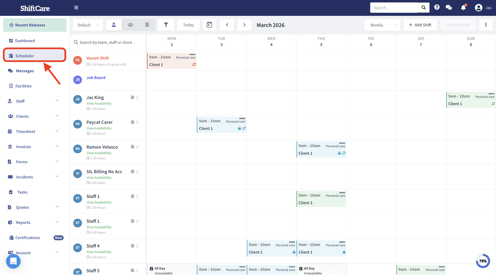
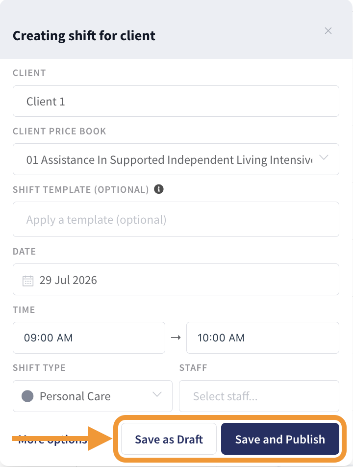

# ShiftCare integration preparation

Checked 10 October 2026. This document connects public ShiftCare evidence to the existing prototype. It does not certify OCD's live account or enable native writes.

## Implemented backend

All five application endpoints now dispatch through the same NestJS application: workflow/intake, push, ShiftCare reads, integration proof and shared arrivals. HTTP handlers and the ShiftCare client are strict TypeScript under `backend/`. Nest classes provide routing; application logic remains procedural. Existing CommonJS domain/storage helpers under `lib/` remain in place. Small CommonJS adapters retain local-server, Vercel and existing import compatibility.

Run `npm start` from the repository root; this compiles the backend before starting the existing system. Use `PORT=8002 npm start` for port 8002. `npm run build` compiles TypeScript and prepares the static workspace; Vercel includes the compiled backend and required domain helpers in each API function. No new login system was introduced.

Open **Office → ShiftCare connection**, at `#/office/shiftcare`. The existing connection check verifies a client read. **Check clients, staff & bookings** independently checks all three resources for the entered dates (today by default). One successful resource does not certify the others. A successful empty page verifies read access, not the existence of matching records.

The readiness API is an authenticated, same-origin GET:

```text
/api/shiftcare?action=readiness&from=2026-10-10&to=2026-10-10
```

It returns each resource's outcome without its records or secrets. Dates are validated before requests; reads have timeouts and response limits. `readsReady` describes this check only. `nativeWritesEnabled` and `liveLocationEnabled` remain false.

## Official workflow screenshots

These are ShiftCare's public training images, downloaded and visually inspected. They are reference material, not screenshots of OCD's account. Copyright remains with ShiftCare; they are not used as application artwork.

### Weekly roster



Source: [Scheduler interface and navigation](https://help.shiftcare.com/en/articles/3703862-scheduler-interface-and-navigation). The screenshot contains staff rows, a vacant-shift row, date navigation and booking states. Integration implication: preserve occurrence IDs, assignments and financial locks; a coloured calendar tile alone does not establish completion.

### Create booking



Source: [Create a shift in the scheduler](https://help.shiftcare.com/en/articles/3852009-create-a-shift-in-the-scheduler-roster). The form separates draft from publication and includes client price book, date/time, shift type and staff. Integration implication: proposed bookings must retain these distinctions; participant agreement alone does not publish or assign a shift.

## Account connection

An administrator needs an eligible Premium/Enterprise account, API key, numeric account ID, correct region and the account's IANA time zone. Keys are generated at **Integrations → API** and shown once. Basic authentication uses account ID as username and API key as password. [Official API key setup](https://help.shiftcare.com/en/articles/13906196-managing-api-keys).

Set these server-only values in ignored `.env.local`, then restart:

```dotenv
SHIFTCARE_API_REGION=au
SHIFTCARE_ACCOUNT_ID=
SHIFTCARE_API_KEY=
SHIFTCARE_TIME_ZONE=Australia/Perth
```

Use the actual account time zone; Perth is an example. Readiness should pass for clients, staff and a bounded shift window before using live records. Credentials were not submitted or tested against a live account during this change.

## Verified API contract and integration map

The [official V3 documentation](https://app.shiftcare.com/api/v3) loads a [public Swagger specification](https://app.shiftcare.com/api/v3/swagger_doc). The specification was fetched directly because the web reader could not render it. Its published contract supports the following application reads:

| Application projection | REST endpoint | Fields retained here |
| --- | --- | --- |
| Participants | GET /api/v3/clients | id, display name |
| Workers | GET /api/v3/staff | id, name |
| Booking occurrences | GET /api/v3/shifts | id, start_at, end_at, client/staff IDs and names |

Pagination uses `page`, `per_page` and `include_metadata`; the adapter conservatively caps pages at 20 records. Shift reads request assignments and account-zone timestamps. Staff listing does not document `time_zone`, so the adapter omits it.

The same published specification includes client/staff creation, shift creation/update/cancellation, notes and documents. Their presence establishes a documented contract, not enabled account permissions or a working website write adapter. Implement and verify each approved operation separately.

Our implementation recommendations:

- Keep a durable identity mapping by account, resource and native ID. Never match people automatically by name alone or replace demo IDs with live records opportunistically.
- Resolve participant, worker, price book and exact occurrence before dispatch. Retain draft/publication, recurrence scope, cancellation treatment and source revision.
- Keep intake approval and audit. After a native write, read the resulting record and verify approved fields before marking the handoff complete. Reconcile an unknown outcome before retrying creation.
- Keep actual attendance and financial evidence separate from scheduled start/end. The existing read projection intentionally cannot establish attendance or invoice eligibility.
- Treat employee addresses, care notes and contacts as separate privileged data; the list adapter returns only the fields needed by the connection screen.

## Worker location boundary

ShiftCare documents GPS-assisted clock-in/out and an optional proximity check. It does not establish that this application's API adapter can subscribe to a continuous worker location feed. [Official mobile attendance guidance](https://help.shiftcare.com/en/articles/3022277-clock-in-and-clock-out-of-shifts-from-the-mobile-app).

Keep the existing consented device-location flow for ETA, with no persisted employee origin and a nearby illustrative car. GPS being enabled for Google Maps or ShiftCare does not grant this application location permission. GPS-off/stale/denied states must withdraw the ETA and offer manual arrival. Production worker/client authorization and background-location support remain separate acceptance work.

## Customer case studies

These are vendor-published customer accounts, not independent research or evidence that an API operation works:

- [Blue Skies Nursing](https://shiftcare.com/us/blog/how-blue-skies-nursing-scaled-faster-by-cutting-admin-time-70): describes disconnected scheduling/billing and reports reducing monthly billing work from 20 hours to six. Design implication: retain one native booking identity through roster, attendance and billing review.
- [Maids in Minnesota](https://shiftcare.com/us/blog/maids-in-minnesota): describes operational overhead for a home-support business. Design implication: validate cleaning/domestic-assistance workflows as well as clinical examples.

## Verification and remaining work

`npm test` exercises the Nest adapters, existing workflow/push/intake contracts, ShiftCare authentication, minimized responses, pagination, time zones, errors and readiness. Tests use fixtures; they do not write to ShiftCare.

This change passed all 88 tests, the production build and whitespace checks. The focused ShiftCare screen test passed. Full browser acceptance could not finish: the default Chrome executable is absent; rerunning with installed Chromium reached Automation but failed at the missing `[data-auto-action="ingest"]` selector. That unrelated interface/script mismatch was left intact.

For a live pilot, verify account permissions, exact write payloads, native read-back, stable identity mapping and shared production job storage. Existing Integration proof captures remain separate from the live-read readiness result. The prototype's Worker/Client persona selectors do not establish production authorization.
